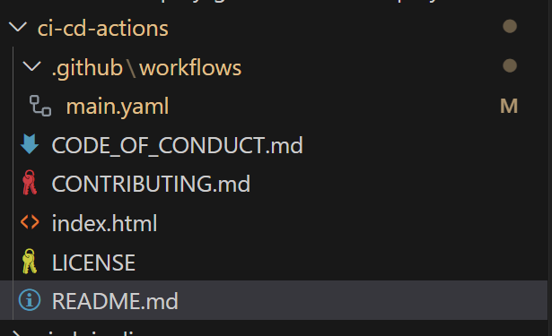

# ci-cd-actions
This repo is used to demonstrate ci-cid pipeline using github actions

1. Create a public repository on your github
2. Create two branches named as "testing" and "main"
3. Switch to testing branch and add code for the application in our case its just an index.html files
4. Now to demonstrate the working of github actions, follow below steps
    
    a. Create a '.github' folder and inside it create a folder names as workflows
        
    
    b. Now create a yaml file names as main.yaml, and add following code inside it
        * Add the code as mentioned in ./.github/workflows/main.yaml
        * If you notice there are secrets used in the flow, we need to add secrets in the repository
    
    c. Add secrets to the repository by following below steps
    * Goto settings tab of your reposotiry
    
    * Scroll down and see the security section and inside it Secrets and variables and click on it.
    
    * Scroll to the bottom of the page and click on 'New repository secret' Button highlighted in green. Add four variables and HOST, KEY, PORT, USERNAME
    Note:- All Variables should be in capital letters
    
5. Add test file inside the repository and test cases that will create a file with true flag if test case is passed and false flag if it fails.

6. Now commit all the changes done and check the actions tab in your repository.
You will notice all the steps are being executed and deployment is successfull.

===================================